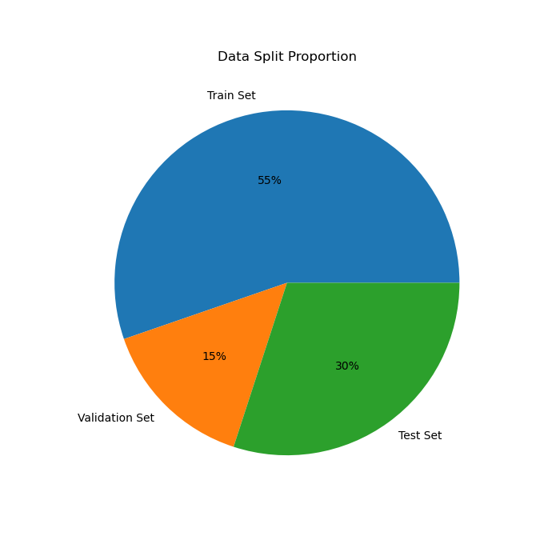
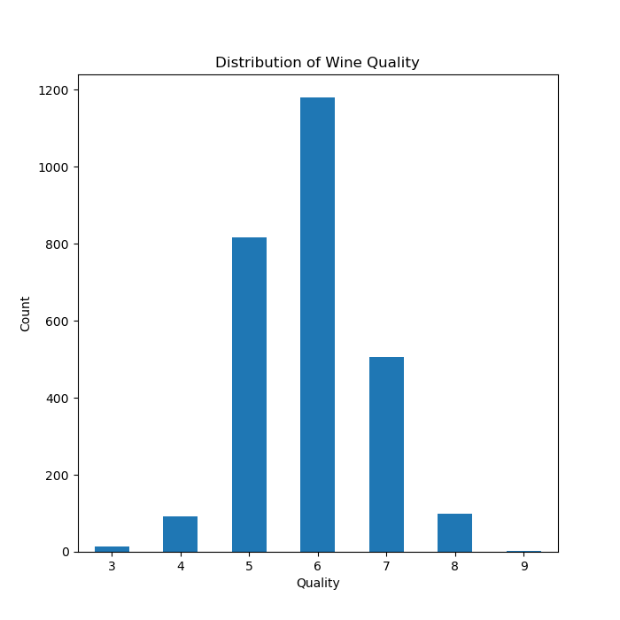
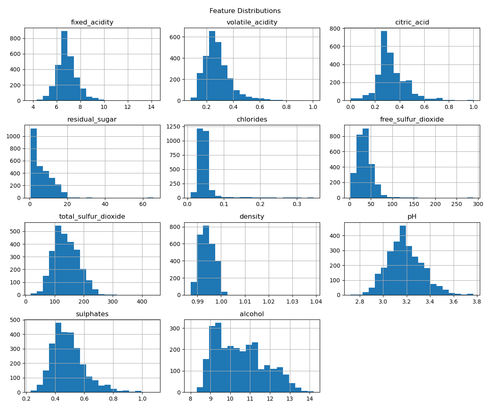
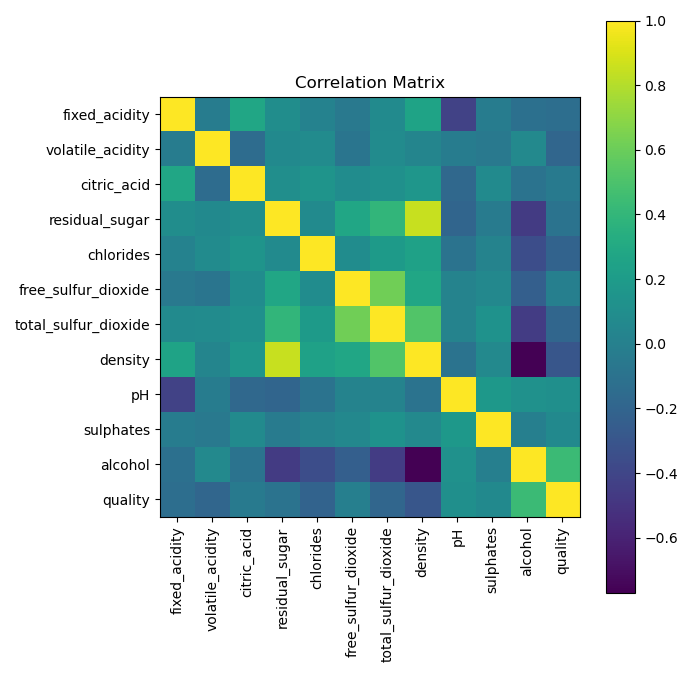
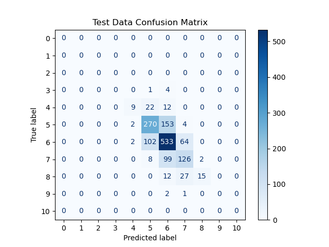

```{python}
import pandas as pd
import matplotlib.pyplot as plt
import sklearn

from ucimlrepo import fetch_ucirepo 
from sklearn.model_selection import train_test_split, GridSearchCV
from sklearn.preprocessing import StandardScaler
from sklearn.ensemble import RandomForestClassifier
from sklearn.metrics import accuracy_score, precision_score, recall_score, f1_score, confusion_matrix, classification_report, ConfusionMatrixDisplay
from IPython.display import Markdown
```

```{python}
# load best model parameters and save each as a variable for inline code
params_df = pd.read_csv('../output/prediction/best_model_parameters.csv')
max_depth = int(params_df['max_depth'].iloc[0])
n_estimators = int(params_df['n_estimators'].iloc[0])

# load raw df and define a variable for raw data length
raw_df = pd.read_csv('../data/raw/winequality-white.csv')
raw_data_len = raw_df.shape[0]

# load train, valid, test data and define len of each data as well as feature and target numbers for inline code
X_train = pd.read_csv('../data/processed/train_data/X_train.csv')
y_train = pd.read_csv('../data/processed/train_data/y_train.csv')
X_valid = pd.read_csv('../data/processed/valid_data/X_valid.csv')
X_test = pd.read_csv('../data/processed/test_data/X_test.csv')
y_test = pd.read_csv('../data/processed/test_data/y_test.csv')

X_train_len = X_train.shape[0]
X_valid_len = X_valid.shape[0]
X_test_len = X_test.shape[0]

feature_num = len(X_train.columns)
target_num = len(y_train.columns)

# define len of red wine and white_wine samples
red_wine_data_len = raw_data_len - X_train_len - X_valid_len - X_test_len
white_wine_data_len = X_train_len + X_valid_len + X_test_len

# get prediction and ground truth, define classification report
pred = pd.read_csv('../data/processed/prediction/test_prediction.csv')
report = classification_report(y_test.values.ravel(), pred.values.ravel(), output_dict=True, zero_division=0)
```

# Summary

This study explored the physicochemical characteristics of white wines and their relationship with quality ratings using exploratory data analysis and machine learning. The analysis showed that most wines fall within mid-range quality scores, with relatively few very low or very high ratings. Several chemical variables exhibit skewed distributions and occasional extreme values, while correlations suggest that wine quality is influenced by multiple factors rather than a single dominant variable. A random forest model was used to predict wine quality, achieving moderate accuracy but showing lower performance on minority classes due to class imbalance. These findings highlight the complexity of predicting wine quality and suggest that future work could improve results by addressing class imbalance and exploring more advanced models.

# Introduction

Wine is one of the most widely consumed beverages in the world, valued for its taste, cultural significance, and sensory qualities. Determining wine quality, even for expert tasters, can be challenging because sensory evaluation is inherently subjective and influenced by multiple factors [@jackson2020]. Vinho verde wine is produced in the Minho region of northern Portugal and is known for its light and fresh characteristics.

In this project, we focus on white vinho verde wine and investigate the following question: **can a Random Forest classifier, trained on physicochemical measurements of white vinho verde wine (including acidity, residual sugar, and alcohol content), accurately predict expert-assigned quality scores across all score categories (3–9)?** To answer this question, we use a dataset from the UC Irvine Machine Learning Repository [@cortez2009] and evaluate model performance with particular attention to minority class prediction under class imbalance.

## Dataset Description

The [Wine Quality dataset](https://archive-beta.ics.uci.edu/dataset/186/wine+quality) contains physicochemical measurements of Portuguese *Vinho Verde* wines. Each observation corresponds to a wine sample that was evaluated using laboratory tests and sensory analysis by wine experts.

The dataset includes `{python} feature_num` physicochemical input variables (e.g., acidity, pH, alcohol content) and `{python} target_num` target variable representing wine quality. Wine quality scores were assigned as the median of at least three expert evaluations, with ratings ranging from 0 (very bad) to 10 (excellent). The full dataset contains two subsets — red wine (`{python} red_wine_data_len` observations) and white wine (`{python} white_wine_data_len` observations) — of which we use only the white wine subset as it contains the larger number of samples.

```{python}
#| label: tbl-feature-description
#| tbl-cap: Description of dataset variables

feature_df = pd.read_csv("../output/eda/feature_description.csv")
feature_df['Description'] = feature_df['Description'].str[:50] + '...'
Markdown(feature_df.head(20).to_markdown(index=False))
```

@tbl-feature-description shows that all features are numerical and there are no missing values in any feature.

# Method

## Dataset & Data Cleaning

The Wine Quality dataset is retrieved directly from the **UCI Machine Learning Repository** using the `ucimlrepo` library. The dataset is returned with the features (input variables) and the target variable (wine quality score) stored separately.

To recreate the original dataset structure, we combine the features and target into a single DataFrame. This produces a table where each row represents a wine sample and each column represents a physicochemical property or the quality score. However, this results in a DataFrame that contains both red and white wine data. Since we only aim to use white wine data, we clean the data by dropping the first `{python} red_wine_data_len` samples, which correspond to red wine data, leaving only the `{python} white_wine_data_len` white wine samples.

## Exploratory Data Analysis

Since EDA is generally performed after splitting the data, we first split the dataset into training and test sets, and then perform EDA using the training set. The dataset is initially split with a 70/30 ratio, and the train set is further split into train and validation sets. Consequently, the train set contains `{python} X_train_len` samples, the validation set contains `{python} X_valid_len` samples, and the test set contains `{python} X_test_len` samples.

We examine the basic structure of the dataset by checking its shape, column names, data types, missing values, and statistical summary of each feature. We visualize the distribution of the target variable `quality` using a bar chart, which helps us understand how wine quality scores are distributed across the dataset. We also generate histograms for each physicochemical feature to observe patterns such as skewness, spread, and potential outliers. Finally, we compute and visualize a correlation matrix to measure the linear relationships between all numerical variables.

## Prediction

To model wine quality, we require a method that can capture complex and potentially non-linear relationships between physicochemical features such as acidity, sugar content, and alcohol level. Preliminary exploration suggests that these variables may interact in ways that are not well represented by simple linear models. Additionally, the dataset contains multiple continuous predictors with possible correlations and varying scales, making model flexibility important. For this reason, we use the Random Forest algorithm, an ensemble learning method that builds multiple decision trees and aggregates their predictions [@sagi2018]. Random Forest is well-suited for this task because it can handle non-linear patterns, is robust to overfitting through averaging, and provides insight into feature importance.

Since the random forest classifier is scale-invariant, we do not scale the data before training. Grid search is used to explore various combinations of hyperparameters, and the best performing model with `max_depth` of `{python} max_depth` and `n_estimators` of `{python} n_estimators` is selected. The best model is evaluated using a classification report and confusion matrix on the held-out test set.

# Results

## Exploratory Data Analysis

### Data Split

{#fig-pie-chart width=50%}

@fig-pie-chart visualizes the proportion of each split. The training set accounts for 55% of the data, the test set for 30%, and the validation set for the remaining 15%.

### Dataset Structure

```{python}
#| label: tbl-summary-stat
#| tbl-cap: Training Set Summary Statistics

Markdown(X_train.describe().T.round(2).to_markdown())
```

@tbl-summary-stat summarizes the training set. The dataset contains `{python} X_train_len` samples across `{python} feature_num` features, all of which are numerical with no missing values. Features vary considerably in scale: for instance, `total sulfur dioxide` ranges into the hundreds while `density` remains close to 1.0 throughout. This variation in scale and range is expected given the different physical and chemical properties being measured.

### Distribution of Wine Quality Scores

{#fig-wine-quality-hist width=70%}

@fig-wine-quality-hist shows that the distribution of wine quality scores is concentrated around the middle values. Most wines are rated 5, 6, or 7, with quality 6 being the most frequent. Very few wines receive extreme ratings such as 3 or 9, indicating that the dataset contains mostly average-quality wines and relatively few very poor or excellent samples. This significant class imbalance raises concerns that the model may perform poorly on minority classes. Furthermore, although the UCI Machine Learning Repository lists quality ratings ranging from 0 to 10, no samples exist for ratings 0, 1, 2, or 10, meaning the model will never encounter these classes during training.

### Feature Distributions

{#fig-feature-dist width=70% fig-pos="H"}

@fig-feature-dist shows that most physicochemical variables fall within fairly narrow ranges. For example, pH values are centered around 3.1 with a small spread, and density is close to 0.995 for most wines. Alcohol content ranges roughly from 9% to 14%, with an average around 10.5%. In contrast, residual sugar varies much more widely — from under 1 to over 60 — indicating some extreme observations.

Several variables are right-skewed, meaning most wines have lower values with a few much larger observations. This pattern is especially noticeable for chlorides, residual sugar, sulphates, and fixed acidity. Total sulfur dioxide appears more evenly distributed around its average.

### Correlation Matrix

{#fig-corr-mat width=70%}

@fig-corr-mat shows the strength and direction of linear relationships between the variables. Overall, most physicochemical features have relatively weak correlations with wine quality, suggesting that quality is influenced by multiple factors rather than a single dominant variable. Alcohol content shows a positive relationship with quality, while volatile acidity and density show negative relationships. Several input variables also exhibit moderate correlations with each other, indicating that some chemical properties are related.

## Prediction

```{python}
#| label: tbl-model-params
#| tbl-cap: Best Performing Model Parameters

Markdown(params_df.head().to_markdown(index=False))
```

As shown in @tbl-model-params, the best hyperparameters found via grid search are a `max_depth` of `{python} max_depth` and `n_estimators` of `{python} n_estimators`.

```{python}
macro_accuracy = round(100 * report['accuracy'])
macro_precision = round(100 * report["macro avg"]['precision'])
macro_recall = round(100 * report["macro avg"]['recall'])
macro_f1_score = round(100 * report["macro avg"]['f1-score'])

quality_4_precision = round(100 * report["4"]['precision'])
quality_6_precision = round(100 * report["6"]['precision'])
quality_8_precision = round(100 * report["8"]['precision'])
```

The model performance metrics are defined as follows:

- **Accuracy** ($\frac{TP + TN}{TP + TN + FP + FN}$): proportion of correct classifications out of all predictions.
- **Precision** ($\frac{TP}{TP+FP}$): proportion of correct positive predictions out of all positive predictions.
- **Recall** ($\frac{TP}{TP+FN}$): proportion of correct positive predictions out of all actual positive samples.
- **F1-score** ($2 \times \frac{Precision \times Recall}{Precision + Recall}$): harmonic mean of precision and recall, useful under class imbalance.

The model achieves a macro test accuracy of `{python} macro_accuracy`%, with macro precision of `{python} macro_precision`% and macro recall of `{python} macro_recall`%, indicating suboptimal overall classification performance. Given the significant class imbalance in the dataset, accuracy alone is not a reliable metric, and the macro-averaged scores reflect the model's difficulty with minority classes.

{#fig-conf-mat width=70% fig-pos="H"}

There is a notable gap in precision between minority and dominant classes: wine quality 4 and 8 have precision of `{python} quality_4_precision`% and `{python} quality_8_precision`% respectively, while the most frequent class (quality 6) achieves `{python} quality_6_precision`%. @fig-conf-mat further illustrates this pattern — dominant classes show more true positives, while minority classes have more false positives than true positives. Both minority classes also have the lowest F1-scores, confirming that the model's performance is biased toward dominant classes. Even among dominant classes (5, 6, and 7), F1-scores remain moderate, suggesting that the model's overall ability to predict white wine quality is limited.

# Discussion

The exploratory data analysis suggests that most wines in the dataset fall into average quality categories, with ratings concentrated around the middle of the scale, indicating significant class imbalance. The distributions of many physicochemical variables show that most measurements lie within typical ranges, although residual sugar and chlorides exhibit wider spreads and occasional extreme values. Several variables also appear right-skewed. The correlation analysis further indicates that no single variable strongly determines wine quality; instead, quality appears to be influenced by a combination of multiple chemical characteristics.

The random forest classifier with `max_depth` of `{python} max_depth` and `n_estimators` of `{python} n_estimators` is selected through grid search. The model achieves a macro test accuracy of `{python} macro_accuracy`%, a precision of `{python} macro_precision`%, a recall of `{python} macro_recall`%, and an F1-score of `{python} macro_f1_score`%, indicating underperformance in predicting white wine quality. Since this is a multi-class classification task rather than binary classification, some degree of error is expected. Similar studies have found that machine learning can identify relationships between chemical composition and wine quality, but prediction accuracy often depends on model choice and feature representation [@rodriguez2015; @sagi2018]. The model's biased performance toward dominant classes is expected, as no class imbalance handling was applied.

Future work could address class imbalance through oversampling, undersampling, or class reweighting to improve fairness and performance across all quality levels. Testing more advanced models such as gradient boosting or neural networks may also help capture more complex variable relationships. Further research could examine whether additional sensory or production data improves predictive performance.

# References
